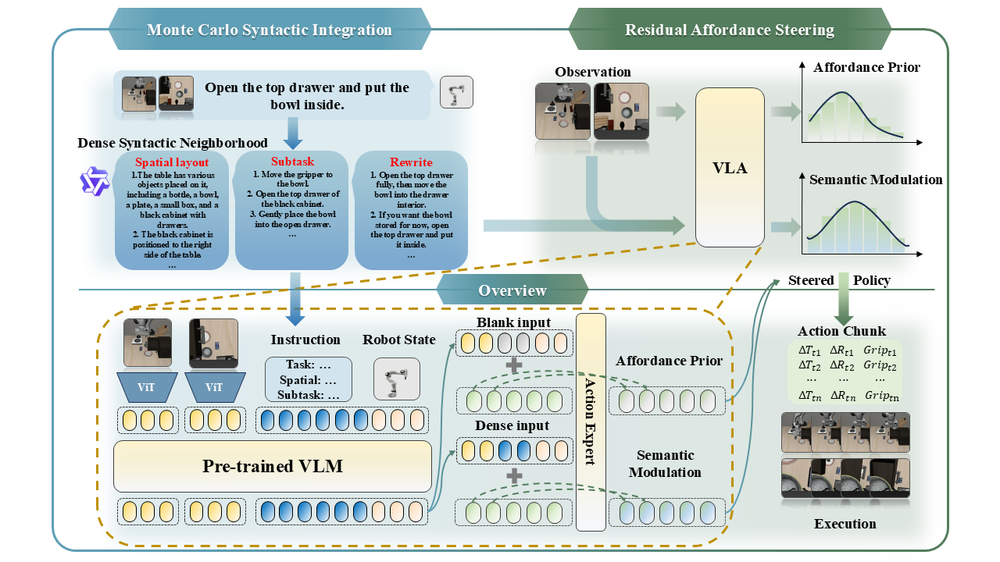
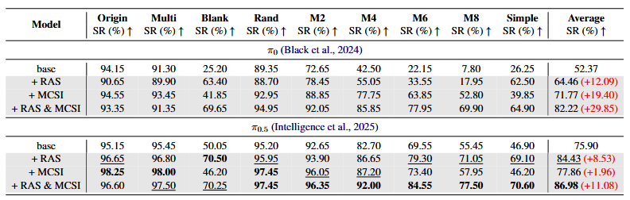
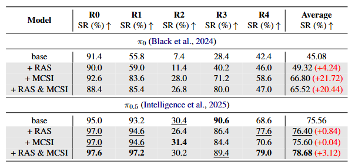
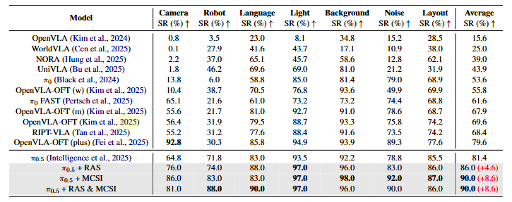

# Stable Language Guidance for Vision-Language-Action Models

<p align="center">
<b>ACL 2026 Main Conference</b>
</p>


<p align="center">
<a href="https://aclanthology.org/2026.acl-long.190/"></a>
<a href="https://arxiv.org/abs/2601.04052"></a>
<a href="https://github.com/Doo-mon/RSS"></a>
<a href="https://huggingface.co/doomon/RSS_pi05_cfg_libero_caption"></a>
</p>

<p align="center">
Zhihao Zhan<sup>1</sup>, Yuhao Chen<sup>1</sup>, Jiaying Zhou<sup>1</sup>, Qinhan Lyu<sup>1</sup>, Hao Liu<sup>1</sup>, Keze Wang<sup>1,2,3</sup>, Liang Lin<sup>1,2,3</sup>, Guangrun Wang<sup>*1,2,3</sup>
</p>

<p align="center">
<sup>1</sup>Sun Yat-sen University, <sup>2</sup>Guangdong Key Laboratory of Big Data Analysis and Processing, <sup>3</sup>X-Era AI Lab.
</p>

<p align="center">
<sup>*</sup>Corresponding author 
</p>


## 📣 News

- **[2026-08-19]** The official paper is now available on [ACL Anthology](https://aclanthology.org/2026.acl-long.190/).
- **[2026-05-08]** Update results and we are uploading full checkpoints.
- **[2026-04-16]** Codebase released.
- **[2026-04-07]** Accepted by ACL 2026 Main Conference 🎉


## ✨ Abstract


Vision-Language-Action (VLA) models have demonstrated impressive capabilities in generalized robotic control; however, they remain notoriously brittle to linguistic perturbations. We identify a critical ``modality collapse'' phenomenon where strong visual priors overwhelm sparse linguistic signals, causing agents to overfit to specific instruction phrasings while ignoring the underlying semantic intent. To address this, we propose **Residual Semantic Steering (RSS)**, a probabilistic framework that disentangles physical affordance from semantic execution. RSS introduces two theoretical innovations: (1) **Monte Carlo Syntactic Integration**, which approximates the true semantic posterior via dense, LLM-driven distributional expansion, and (2) **Residual Affordance Steering**, a dual-stream decoding mechanism that explicitly isolates the causal influence of language by subtracting the visual affordance prior. Theoretical analysis suggests that RSS effectively maximizes the mutual information between action and intent while suppressing visual distractors. Empirical results across diverse manipulation benchmarks demonstrate that RSS achieves state-of-the-art robustness, maintaining performance even under adversarial linguistic perturbations.

## 📊 Results

RSS demonstrates strong robustness and generalization across diverse language-conditioned robotic manipulation benchmarks.

### 🔥 Robustness under Destructive Instruction Overwriting

We evaluate RSS under progressively destructive instruction corruption settings, including random token insertion, semantic masking, and multi-level perturbations.



RSS consistently improves robustness across all perturbation levels. In particular, combining **Residual Affordance Steering (RAS)** with **Monte Carlo Syntactic Integration (MCSI)** yields substantial gains over both $\pi_0$ and $\pi_{0.5}$ baselines, improving average success rate by up to **+29.85%**.

---

### 🔄 Obfuscated Instruction Reinterpretation

We further evaluate semantic recovery under heavily obfuscated language instructions.



RSS effectively preserves semantic alignment even when instruction structures are rewritten or partially obscured. MCSI notably improves semantic reinterpretation ability by approximating the latent semantic posterior through distributional prompt expansion.

---

### 🌍 LIBERO-Plus Generalization Benchmark

We evaluate RSS on LIBERO-Plus under diverse distribution shifts, including camera, robot embodiment, language, lighting, background, noise, and layout variations.



RSS achieves state-of-the-art robustness and generalization performance across multiple challenging settings. On top of $\pi_{0.5}$, RSS improves average success rate from **81.4% → 90.0%**, demonstrating strong cross-domain transfer capability under severe distribution shifts.

---

### ✨ Key Takeaways

- RSS substantially improves robustness to adversarial and corrupted instructions.
- The combination of RAS and MCSI consistently delivers the strongest performance across benchmarks.


## ⚙️ Setup

### uv
We manage Python dependencies with [uv](https://docs.astral.sh/uv/). If you haven't installed `uv`, please follow [uv installation instructions](https://docs.astral.sh/uv/getting-started/installation/) to set it up.

Run the following to set up the environment:

```bash
git clone --recurse-submodules git@github.com:Doo-mon/RSS.git

# Or if you already cloned the repo:
git submodule update --init --recursive

GIT_LFS_SKIP_SMUDGE=1 uv sync
GIT_LFS_SKIP_SMUDGE=1 uv pip install -e .
```

For more details, refer to the original [openpi repository](https://github.com/Physical-Intelligence/openpi).


## 🚀 Training / Inference / Deployment

### Caption Data Preparation

We provide three caption-generation pipelines based on open-source vision-language models:

- [InternVL3-8B](https://huggingface.co/OpenGVLab/InternVL3-8B-hf): [`convert_libero_caption_data_to_lerobot_intern.py`](examples/libero_shortcut/convert_libero_caption_data_to_lerobot_intern.py)
- [LLaVA-OneVision-Qwen2-7B](https://huggingface.co/llava-hf/llava-onevision-qwen2-7b-ov-hf): [`convert_libero_caption_data_to_lerobot_llava.py`](examples/libero_shortcut/convert_libero_caption_data_to_lerobot_llava.py)
- [Qwen2.5-VL-7B-Instruct](https://huggingface.co/Qwen/Qwen2.5-VL-7B-Instruct): [`convert_libero_caption_data_to_lerobot_qwen.py`](examples/libero_shortcut/convert_libero_caption_data_to_lerobot_qwen.py)

Update the model and dataset paths in the selected script before running it in your local environment.


### Multiple Inference Settings

See the `main_*.py` scripts in [`examples/libero_shortcut`](examples/libero_shortcut/).


### Commands

Use [`run_train.sh`](run_train.sh), [`run_server_eval.sh`](run_server_eval.sh), and [`run_local_eval.sh`](run_local_eval.sh) for training, server-based evaluation, and local evaluation, respectively.


## Citation
If you find our work useful, please consider citing:

```bibtex
@inproceedings{zhan-etal-2026-stable,
  title = "Stable Language Guidance for Vision{--}Language{--}Action Models",
  author = "Zhan, Zhihao  and
    Chen, Yuhao  and
    Zhou, Jiaying  and
    Lyu, Qinhan  and
    Liu, Hao  and
    Wang, Keze  and
    Lin, Liang  and
    Wang, Guangrun",
  editor = "Liakata, Maria  and
    Moreira, Viviane P.  and
    Zhang, Jiajun  and
    Jurgens, David",
  booktitle = "Proceedings of the 64th Annual Meeting of the {A}ssociation for {C}omputational {L}inguistics (Volume 1: Long Papers)",
  month = jul,
  year = "2026",
  address = "San Diego, California, United States",
  publisher = "Association for Computational Linguistics",
  url = "https://aclanthology.org/2026.acl-long.190/",
  doi = "10.18653/v1/2026.acl-long.190",
  pages = "4137--4159",
  isbn = "979-8-89176-390-6"
}
```

## Acknowledgements

This project builds on several outstanding open-source efforts. We sincerely thank:

- The [OpenPI](https://github.com/Physical-Intelligence/openpi) team for releasing the foundational VLA codebase on which this implementation is built.
- The [LIBERO](https://github.com/Lifelong-Robot-Learning/LIBERO) and [LIBERO-Plus](https://github.com/sylvestf/LIBERO-plus) teams for providing the robotic manipulation benchmarks used in our evaluation.
- The [robosuite](https://github.com/ARISE-Initiative/robosuite) team for the simulation utilities used by our LIBERO evaluation scripts, and the [LeRobot](https://github.com/huggingface/lerobot) team for the dataset tooling used in our data pipeline.
- The developers of [InternVL3](https://github.com/OpenGVLab/InternVL), [LLaVA-OneVision](https://github.com/LLaVA-VL/LLaVA-NeXT), and [Qwen2.5-VL](https://github.com/QwenLM-corp/Qwen2.5-VL) for open-sourcing the vision-language models used in our caption-generation pipeline.
- The [Hugging Face Transformers](https://github.com/huggingface/transformers) and Google Research teams behind [PaliGemma](https://ai.google.dev/gemma/docs/paligemma) and [SigLIP](https://github.com/google-research/big_vision) for the model implementations and pretrained components used by the underlying VLA architecture.

We are grateful to the broader open-source robotics and multimodal-learning communities for making this research possible.

## License

This project is licensed under the [Apache License 2.0](LICENSE). Gemma and PaliGemma components are additionally subject to the terms in [LICENSE_GEMMA.txt](LICENSE_GEMMA.txt).
